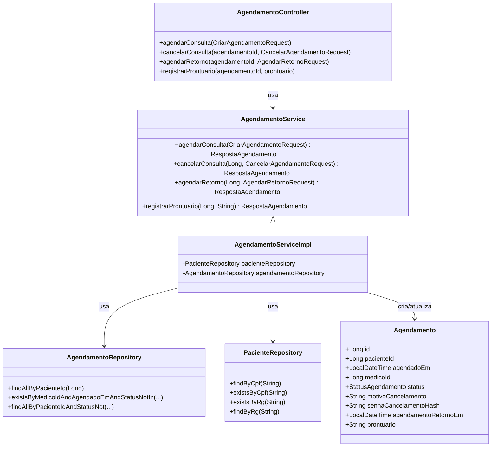
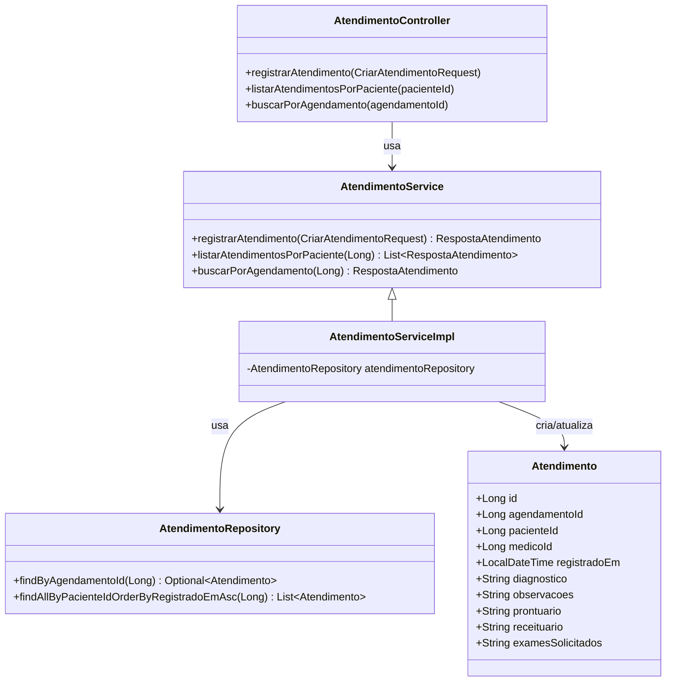
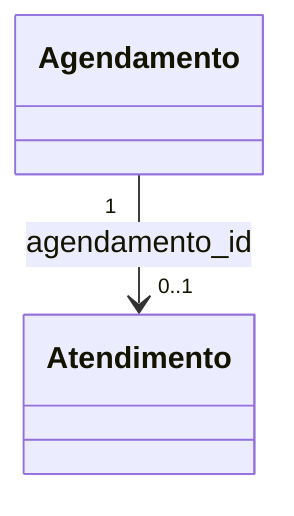

# Diagrama de Classe (Uso) — Agendamento e Atendimento

## Módulo Agendamento (appointment-service)

## Módulo Atendimento (attendance-service)

## Relacionamento: Agendamento → Atendimento

- No código/entidades, **`atendimentos` possui `agendamento_id`** (campo `Atendimento.agendamentoId`).
- O service do atendimento impede duplicidade: ele valida se já existe atendimento para o `agendamentoId`.
- Assim, o relacionamento prático é:
  - **Agendamento (1)** → **Atendimento (0..1)**

