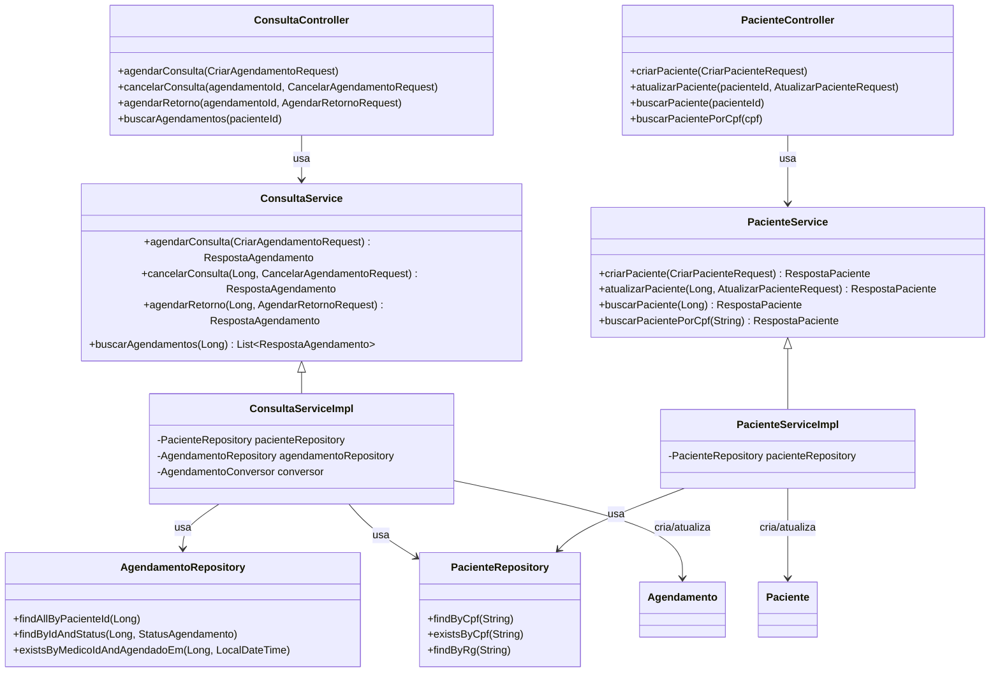
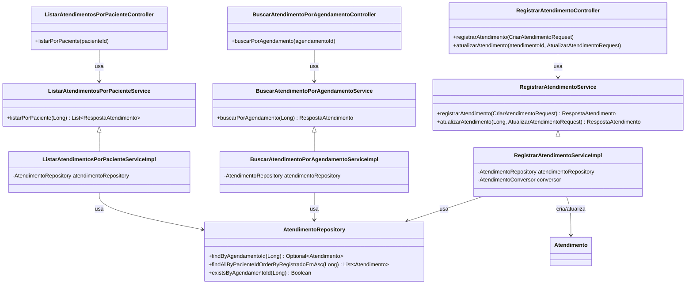
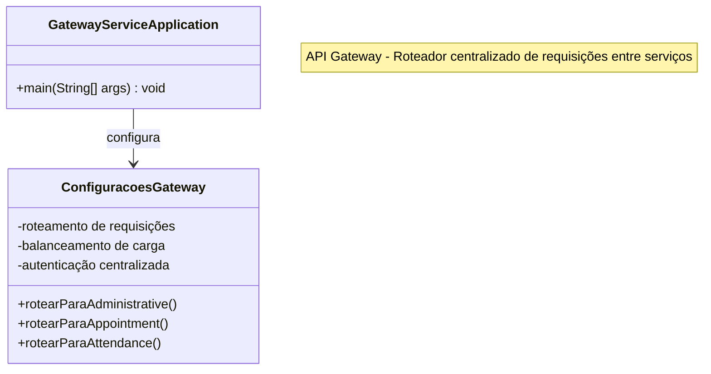
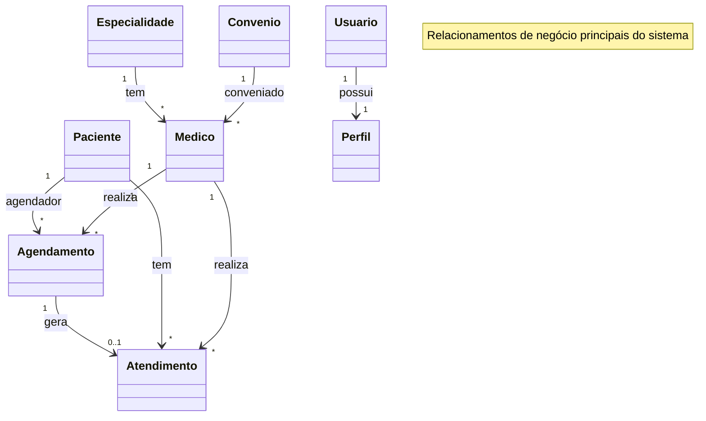
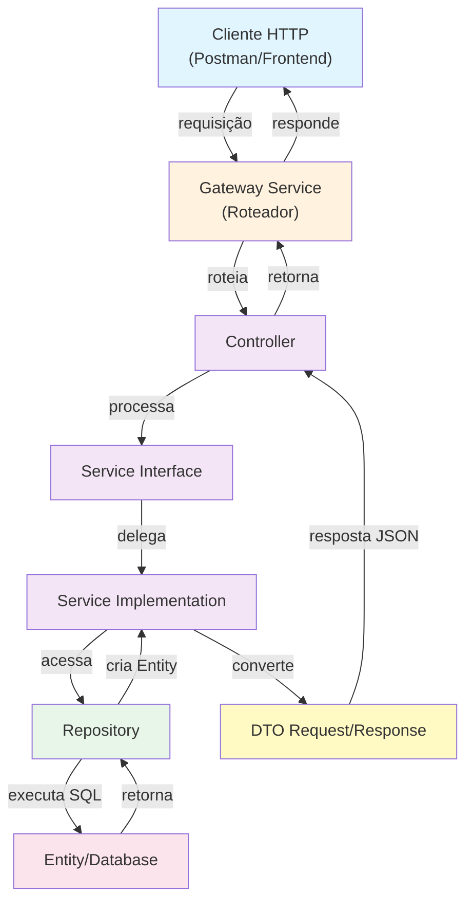

# Diagrama de Classes (Uso) — Sistema Completo IMEPAC Clínica Médica

## Módulo Commons (Compartilhado)

```mermaid
classDiagram
  %% =========================
  %% Commons - Entidades
  %% =========================
  class Usuario {
    +Long id
    +String nome
    +String email
    +String cpf
    +String rg
    +String telefone
    +String senha
    +Long perfilId
    +LocalDateTime criadoEm
  }

  class Paciente {
    +Long id
    +String nome
    +String cpf
    +String rg
    +String telefone
    +String email
    +String endereco
    +String cidade
    +String cep
    +Gender genero
    +LocalDate dataNascimento
  }

  class Medico {
    +Long id
    +String nome
    +String cpf
    +String crm
    +String email
    +String telefone
    +Long especialidadeId
    +Long convenioId
    +Boolean ativo
  }

  class Agendamento {
    +Long id
    +Long pacienteId
    +Long medicoId
    +LocalDateTime agendadoEm
    +StatusAgendamento status
    +String motivoCancelamento
    +String senhaCancelamentoHash
    +LocalDateTime agendamentoRetornoEm
    +String prontuario
  }

  class Atendimento {
    +Long id
    +Long agendamentoId
    +Long pacienteId
    +Long medicoId
    +LocalDateTime registradoEm
    +String diagnostico
    +String observacoes
    +String prontuario
    +String receituario
    +String examesSolicitados
  }

  class Especialidade {
    +Long id
    +String nome
    +String descricao
    +String codigoAreaMedica
  }

  class Convenio {
    +Long id
    +String nome
    +String cnpj
    +String email
    +String telefone
    +String endereco
    +Boolean ativo
  }

  class Funcionario {
    +Long id
    +String nome
    +String cpf
    +String rg
    +String email
    +String telefone
    +String cargo
    +LocalDateTime dataAdmissao
  }

  class Perfil {
    +Long id
    +String nome
    +Set~String~ permissoes
  }

  class ApiResponse {
    +Boolean success
    +String message
    +T data
    +List~String~ errors
    +LocalDateTime timestamp
  }
```

---

## Módulo Administrativo (administrative-service)

```mermaid
classDiagram
  %% =========================
  %% Administrative Service
  %% =========================
  UsuarioController --> UsuarioService : usa
  MedicoController --> MedicoService : usa
  EspecialidadeController --> EspecialidadeService : usa
  ConvenioController --> ConvenioService : usa
  FuncionarioController --> FuncionarioService : usa

  UsuarioService <|-- UsuarioServiceImpl
  MedicoService <|-- MedicoServiceImpl
  EspecialidadeService <|-- EspecialidadeServiceImpl
  ConvenioService <|-- ConvenioServiceImpl
  FuncionarioService <|-- FuncionarioServiceImpl

  UsuarioServiceImpl --> UsuarioRepository : usa
  UsuarioServiceImpl --> PerfilRepository : usa
  UsuarioServiceImpl --> Usuario : cria/atualiza
  UsuarioServiceImpl --> Perfil : associa

  MedicoServiceImpl --> MedicoRepository : usa
  MedicoServiceImpl --> EspecialidadeRepository : usa
  MedicoServiceImpl --> ConvenioRepository : usa
  MedicoServiceImpl --> Medico : cria/atualiza

  EspecialidadeServiceImpl --> EspecialidadeRepository : usa
  EspecialidadeServiceImpl --> Especialidade : cria/atualiza

  ConvenioServiceImpl --> ConvenioRepository : usa
  ConvenioServiceImpl --> Convenio : cria/atualiza

  FuncionarioServiceImpl --> FuncionarioRepository : usa
  FuncionarioServiceImpl --> Funcionario : cria/atualiza

  class UsuarioController {
    +criarUsuario(CriarUsuarioRequest)
    +atualizarUsuario(usuarioId, AtualizarUsuarioRequest)
    +buscarUsuario(usuarioId)
    +listarUsuarios()
    +deletarUsuario(usuarioId)
  }

  class UsuarioService {
    +criarUsuario(CriarUsuarioRequest) RespostaUsuario
    +atualizarUsuario(Long, AtualizarUsuarioRequest) RespostaUsuario
    +buscarUsuario(Long) RespostaUsuario
    +listarUsuarios() List~RespostaUsuario~
    +deletarUsuario(Long) void
  }

  class UsuarioServiceImpl {
    -UsuarioRepository usuarioRepository
    -PerfilRepository perfilRepository
    -AdministracaoConversor conversor
  }

  class UsuarioRepository {
    +findByCpf(String)
    +findByEmail(String)
    +existsByCpf(String)
    +existsByEmail(String)
  }

  class MedicoController {
    +criarMedico(CriarMedicoRequest)
    +atualizarMedico(medicoId, AtualizarMedicoRequest)
    +buscarMedico(medicoId)
    +listarMedicos()
    +listarMedicosPorEspecialidade(especialidadeId)
  }

  class MedicoService {
    +criarMedico(CriarMedicoRequest) RespostaMedico
    +atualizarMedico(Long, AtualizarMedicoRequest) RespostaMedico
    +buscarMedico(Long) RespostaMedico
    +listarMedicos() List~RespostaMedico~
    +listarMedicosPorEspecialidade(Long) List~RespostaMedico~
  }

  class MedicoServiceImpl {
    -MedicoRepository medicoRepository
    -EspecialidadeRepository especialidadeRepository
    -ConvenioRepository convenioRepository
  }

  class MedicoRepository {
    +findByEspecialidadeId(Long)
    +findByCrm(String)
    +findByConvenioId(Long)
    +existsByCrm(String)
  }

  class EspecialidadeController {
    +criarEspecialidade(CriarEspecialidadeRequest)
    +atualizarEspecialidade(especialidadeId, AtualizarEspecialidadeRequest)
    +listarEspecialidades()
  }

  class EspecialidadeService {
    +criarEspecialidade(CriarEspecialidadeRequest) RespostaEspecialidade
    +atualizarEspecialidade(Long, AtualizarEspecialidadeRequest) RespostaEspecialidade
    +listarEspecialidades() List~RespostaEspecialidade~
  }

  class EspecialidadeServiceImpl {
    -EspecialidadeRepository especialidadeRepository
  }

  class EspecialidadeRepository {
    +findByNome(String)
  }

  class ConvenioController {
    +criarConvenio(CriarConvenioRequest)
    +atualizarConvenio(convenioId, AtualizarConvenioRequest)
    +listarConvenios()
  }

  class ConvenioService {
    +criarConvenio(CriarConvenioRequest) RespostaConvenio
    +atualizarConvenio(Long, AtualizarConvenioRequest) RespostaConvenio
    +listarConvenios() List~RespostaConvenio~
  }

  class ConvenioServiceImpl {
    -ConvenioRepository convenioRepository
  }

  class ConvenioRepository {
    +findByCnpj(String)
  }

  class FuncionarioController {
    +criarFuncionario(CriarFuncionarioRequest)
    +atualizarFuncionario(funcionarioId, AtualizarFuncionarioRequest)
    +listarFuncionarios()
  }

  class FuncionarioService {
    +criarFuncionario(CriarFuncionarioRequest) RespostaFuncionario
    +atualizarFuncionario(Long, AtualizarFuncionarioRequest) RespostaFuncionario
    +listarFuncionarios() List~RespostaFuncionario~
  }

  class FuncionarioServiceImpl {
    -FuncionarioRepository funcionarioRepository
  }

  class FuncionarioRepository {
    +findByCpf(String)
  }
```

---

## Módulo Agendamento (appointment-service)

---

## Módulo Atendimento (attendance-service)

---

## Módulo Gateway (gateway-service)

---

## Relacionamentos Entre Módulos

---

## Fluxo de Dados por Camada

---

## Padrões de Arquitetura Utilizados

### 1. **Camadas (Layered Architecture)**
- **Presentation Layer**: Controllers recebem requisições HTTP
- **Business Logic Layer**: Services implementam regras de negócio
- **Data Access Layer**: Repositories abstraem acesso ao banco de dados
- **Data Layer**: Entidades persistem no banco de dados

### 2. **Padrão DTO (Data Transfer Object)**
- Separação entre modelo de dados interno (Entity) e comunicação externa (DTO)
- Request DTOs para entrada de dados
- Response DTOs para saída de dados

### 3. **Padrão Repository**
- Abstração da camada de persistência
- Facilita testabilidade
- Encapsula queries JPA

### 4. **Padrão Service**
- Interface + Implementação
- Centraliza lógica de negócio
- Facilita testes com mocks

### 5. **Padrão Converter/Assembler**
- Conversão bidirecional entre DTO e Entity
- Isolamento de lógica de transformação

### 6. **API Gateway**
- Ponto único de entrada
- Roteamento centralizado
- Autenticação e autorização centralizadas

### 7. **Microsserviços**
- Serviços independentes (administrative, appointment, attendance)
- Banco de dados por serviço
- Comunicação via HTTP/REST

---

## Tecnologias Utilizadas

- **Framework**: Spring Boot 3.x
- **Linguagem**: Java 17+
- **ORM**: JPA/Hibernate
- **Banco de Dados**: MySQL
- **API REST**: Spring Web
- **Comunicação Inter-serviços**: OpenFeign
- **Containerização**: Docker
- **Orquestração**: Kubernetes
- **Dependency Injection**: Spring IoC Container
